<div align="center">
  

  # Makmur Jaya E-Pharmacy

  Sistem E-Commerce Penjualan Obat berbasis web untuk **Klinik Makmur Jaya**

  [](https://laravel.com)
  [](https://php.net)
  [](https://mysql.com)
  [](https://tailwindcss.com)
  [](https://alpinejs.dev)
  [](https://vitejs.dev)
  [](LICENSE)

  Repositori ini dapat diakses di [github.com/HusniAbdillah/e-pharmacy-makmur-jaya-bnsp](https://github.com/HusniAbdillah/e-pharmacy-makmur-jaya-bnsp)

  > Dikembangkan untuk memenuhi prasyarat **Sertifikasi BNSP Skema Web Developer**
</div>

<div align="center">
  <h3>Dokumen Pendukung Kegiatan Terstruktur (Uji Kompetensi)</h3>
  <table>
    <tr>
      <td><a href="docs/1_perencanaan_proyek.md">1. Dokumen Perencanaan Proyek</a></td>
      <td><a href="docs/2_analisis_desain_sistem.md">2. Dokumen Analisis, Perancangan, dan Desain Teknis Sistem</a></td>
    </tr>
    <tr>
      <td><a href="docs/3_migrasi_cutover_perubahan.md">3. Dokumen Migrasi, Cutover, dan Perubahan</a></td>
      <td><a href="docs/4_pengujian.md">4. Dokumen Pengujian (Debugging & UAT)</a></td>
    </tr>
    <tr>
      <td><a href="docs/5_panduan_pengguna.md">5. Dokumen Panduan Pengguna (User Guide & FAQ)</a></td>
      <td><a href="docs/6_analisis_risiko_keamanan.md">6. Analisis Risiko Keamanan Informasi</a></td>
    </tr>
    <tr>
      <td><a href="docs/7_gap_analysis_dan_uat.md">7. Analisis Celah Mendalam & UAT</a></td>
      <td><a href="docs/8_analisis_peran_dan_penggunaan.md">8. Analisis Peran dan Skenario Penggunaan</a></td>
    </tr>
    <tr>
      <td colspan="2" align="center"><a href="docs/system_design_document.md"><strong>9. Dokumen Desain Sistem Lengkap (Use Case Diagram, Use Case Descriptions, Class Diagram, dan Sequence Diagram FIFO)</strong></a></td>
    </tr>
  </table>
</div>

---

## Tentang Aplikasi

Makmur Jaya E-Pharmacy adalah platform e-commerce dan manajemen inventaris apotek terintegrasi yang dirancang untuk membantu **Klinik Makmur Jaya** dalam memantau persediaan obat secara real-time, mengelola transaksi online maupun offline, serta mengotomatiskan alur verifikasi resep dokter oleh Apoteker.

**Fitur unggulan:**
- Autentikasi multi-level (Admin, Apoteker, Kasir, dan Pasien/Pelanggan).
- Katalog obat dengan pencarian dinamis, filter kategori (obat bebas/resep), dan pengurutan harga (termurah/termahal).
- Unggah dan verifikasi resep dokter untuk pembelian golongan obat keras.
- Algoritma pengurangan stok fisik otomatis menggunakan aturan First In First Out (FIFO) berdasarkan masa kadaluarsa terdekat.
- Sistem POS (Point of Sale) konter untuk transaksi offline kasir klinik dengan pencarian autocomplete.
- Ekspor laporan penjualan bulanan berformat PDF yang elegan dengan DOMPDF.
- Parallel CSV bulk import untuk migrasi data master obat secara instan.
- Audit log aktivitas pengguna dan dashboard log viewer dengan pengelompokan severity error.

---

## Antarmuka Aplikasi

<table align="center" style="width: 100%; text-align: center;">
  <tr>
    <td width="50%">
      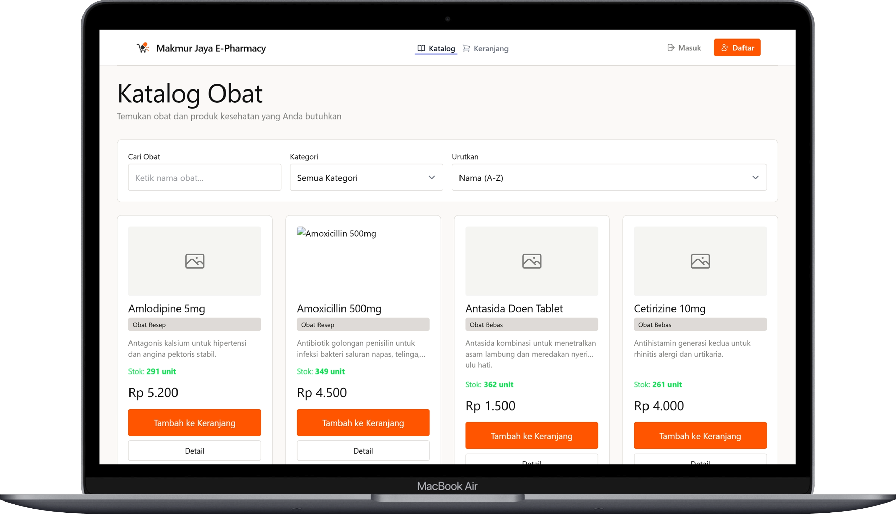<br>
      <sub>Katalog Obat (Guest / Pasien)</sub>
    </td>
    <td width="50%">
      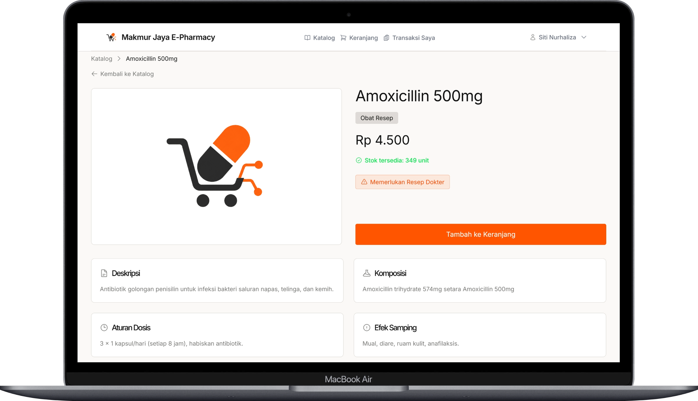<br>
      <sub>Detail Obat (Informasi Dosis & Resep)</sub>
    </td>
  </tr>
  <tr>
    <td width="50%">
      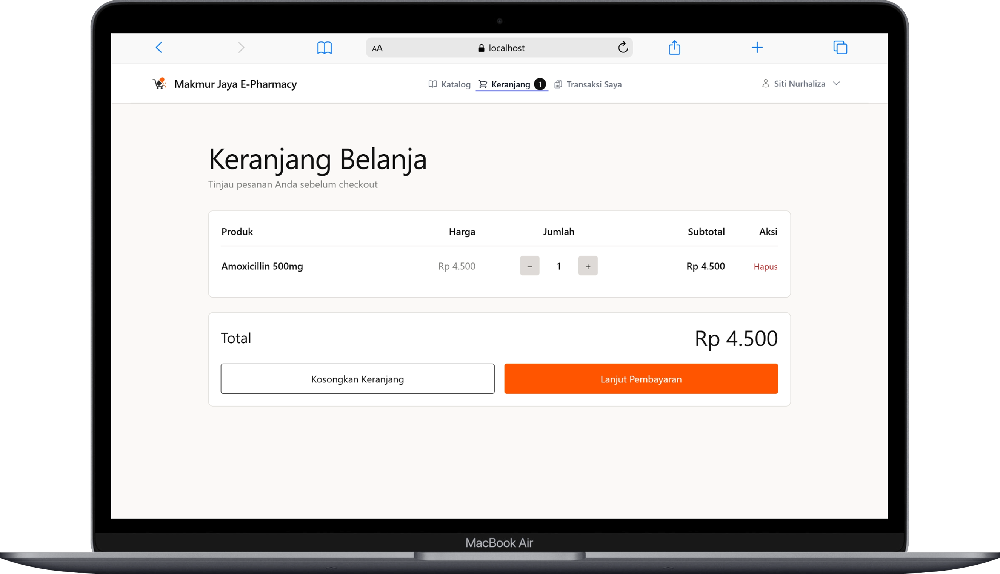<br>
      <sub>Keranjang Belanja Pasien</sub>
    </td>
    <td width="50%">
      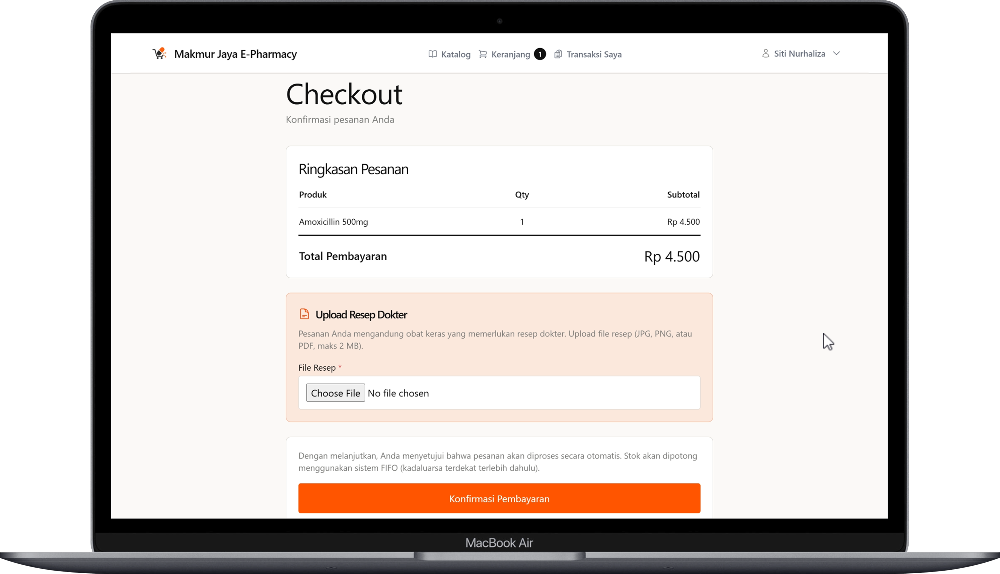<br>
      <sub>Checkout & Unggah Resep Dokter</sub>
    </td>
  </tr>
  <tr>
    <td width="50%">
      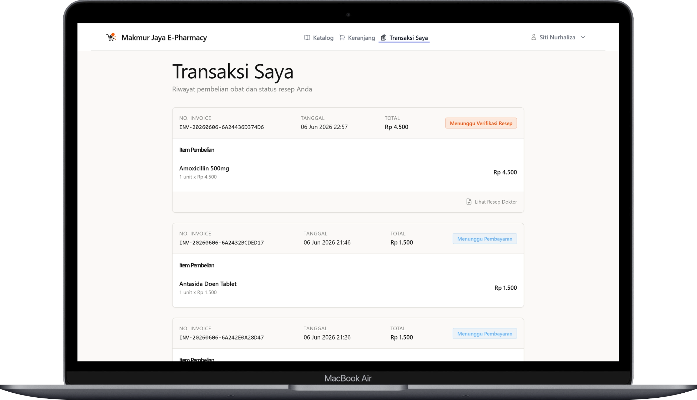<br>
      <sub>Riwayat Transaksi Saya (Pasien)</sub>
    </td>
    <td width="50%">
      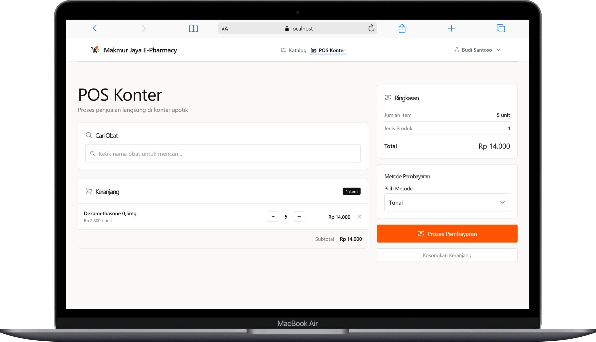<br>
      <sub>Point of Sale / POS Loket Fisik (Kasir)</sub>
    </td>
  </tr>
  <tr>
    <td width="50%">
      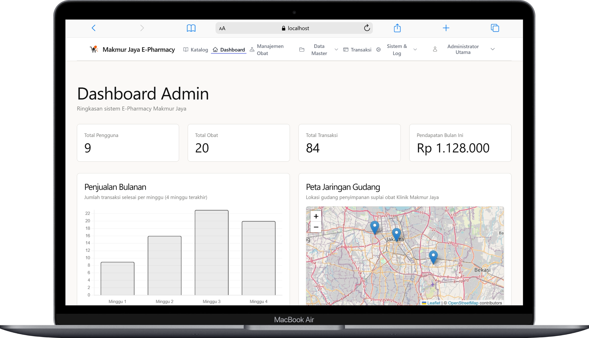<br>
      <sub>Dashboard Utama Administrator</sub>
    </td>
    <td width="50%">
      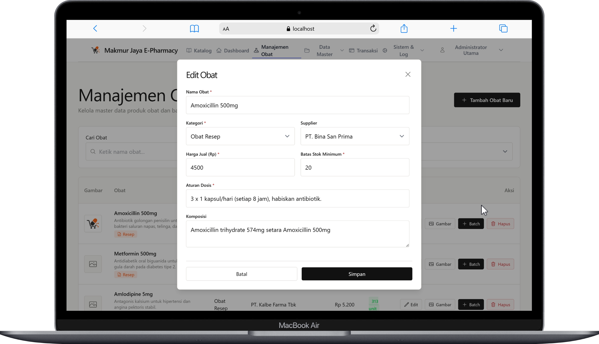<br>
      <sub>Manajemen & Edit Master Obat (Admin)</sub>
    </td>
  </tr>
  <tr>
    <td width="50%" style="text-align: center;">
      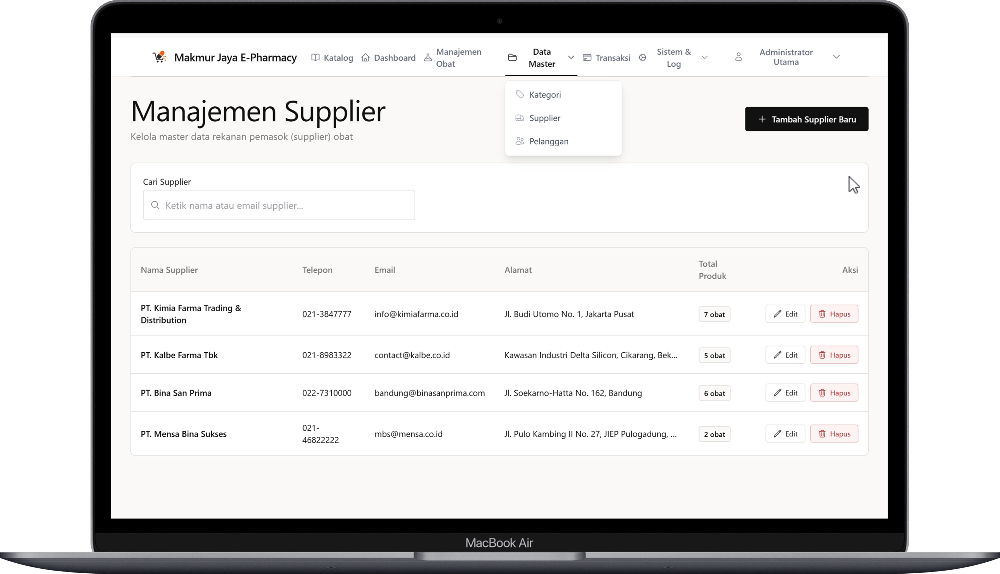<br>
      <sub>Manajemen Master Supplier (Admin)</sub>
    </td>
    <td width="50%" style="text-align: center;">
      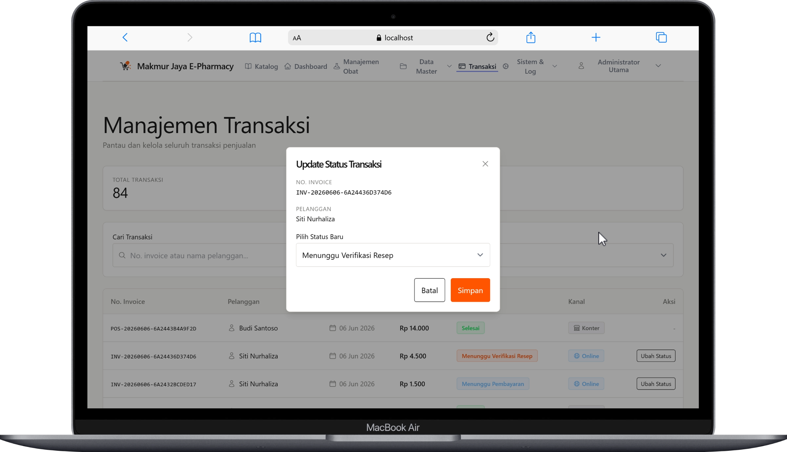<br>
      <sub>Manajemen & Update Status Transaksi (Admin)</sub>
    </td>
  </tr>
  <tr>
    <td width="50%" style="text-align: center;">
      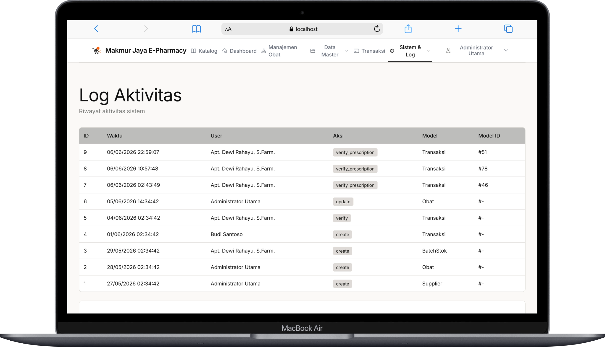<br>
      <sub>Log Aktivitas & Audit Trail Pengguna</sub>
    </td>
    <td width="50%" style="text-align: center;">
      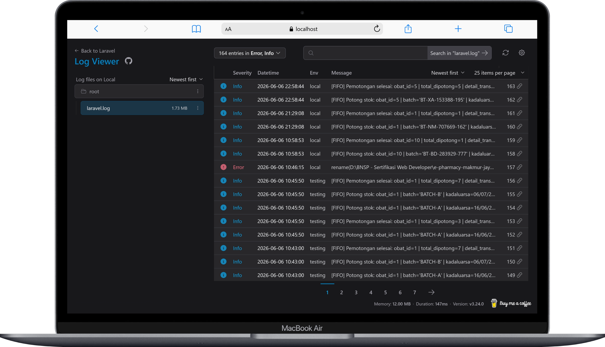<br>
      <sub>Laravel Log Viewer (Pelacakan Log Sistem & Diagnostik Error)</sub>
    </td>
  </tr>
</table>

---

## Prasyarat

| Kebutuhan | Versi |
|-----------|-------|
| PHP | 8.4 (Direkomendasikan) / 8.2+ |
| Composer | 2.x |
| Node.js | 18.x / 20.x |
| MySQL | 8.0 |
| Ekstensi PHP | `gd`, `pdo_mysql`, `mbstring`, `zip`, `bcmath` |

---

## Instalasi

**1. Clone repositori**

```bash
git clone https://github.com/HusniAbdillah/e-pharmacy-makmur-jaya-bnsp.git
cd e-pharmacy-makmur-jaya-bnsp
```

**2. Install dependensi**

```bash
composer install
npm install
```

**3. Konfigurasi environment**

```bash
cp .env.example .env
php artisan key:generate
```

Sesuaikan koneksi database MySQL di file `.env`:

```env
DB_CONNECTION=mysql
DB_HOST=127.0.0.1
DB_PORT=3306
DB_DATABASE=makmur_jaya_db
DB_USERNAME=root
DB_PASSWORD=your_password
```

**4. Migrasi & seeder database**

Perintah ini akan mendeteksi jika database `makmur_jaya_db` belum ada, membuatkannya untuk Anda, menjalankan migrasi skema tabel, dan menyemai data awal (*seed*).
```bash
php artisan migrate --seed
```

**5. Hubungkan link penyimpanan (storage:link)**

Jalankan perintah ini sekali saja untuk membuat tautan simbolik dari direktori publik ke folder penyimpanan media resep/obat:
```bash
php artisan storage:link
```

**6. Build aset frontend**

```bash
# Untuk Produksi
npm run build

# Untuk Pengembangan (hot-reload)
npm run dev
```

**7. Jalankan aplikasi**

```bash
php artisan serve
```

Buka **`http://127.0.0.1:8000`** di browser Anda.

**8. Queue worker (Untuk pemrosesan antrean FIFO)**

```bash
php artisan queue:work
```

**9. Menjalankan Uji Otomatis (PHPUnit/Feature Tests)**

```bash
php artisan test
```

---

## Troubleshooting & Pemeliharaan

Jika Anda mengalami masalah saat instalasi atau pengoperasian, jalankan perintah pemeliharaan berikut:

*   **Masalah Hak Akses File Terkunci (Windows Access Denied pada View Compiler):**
    ```bash
    php artisan view:clear
    ```
*   **Perubahan Konfigurasi `.env` Tidak Terbaca:**
    ```bash
    php artisan config:clear
    php artisan config:cache
    ```
*   **Membersihkan Cache Aplikasi Secara Menyeluruh:**
    ```bash
    php artisan cache:clear
    ```
*   **Mengulang Antrean Job FIFO yang Gagal:**
    ```bash
    php artisan queue:retry all
    ```

---

## Akun Demo Pengujian (Assessor)

| Peran | Email | Password |
|-------|-------|----------|
| Admin | admin@makmurjaya.id | Admin@123 |
| Apoteker | apoteker@makmurjaya.id | Apoteker@123 |
| Kasir | kasir@makmurjaya.id | Kasir@123 |
| Pasien | pasien@makmurjaya.id | Pasien@123 |

---

## Stack Teknologi

| Lapisan | Teknologi |
|---------|-----------|
| Backend | Laravel 11, PHP 8.4 |
| Frontend | Tailwind CSS 3, Alpine.js 3, Livewire 3, Vite |
| Database | MySQL 8.0 |
| PDF | DomPDF (barryvdh/laravel-dompdf) |
| Autentikasi | Laravel Breeze (session-based) dengan Volt Component |
| Ikon | Blade Heroicons (blade-ui-kit/blade-heroicons) |
