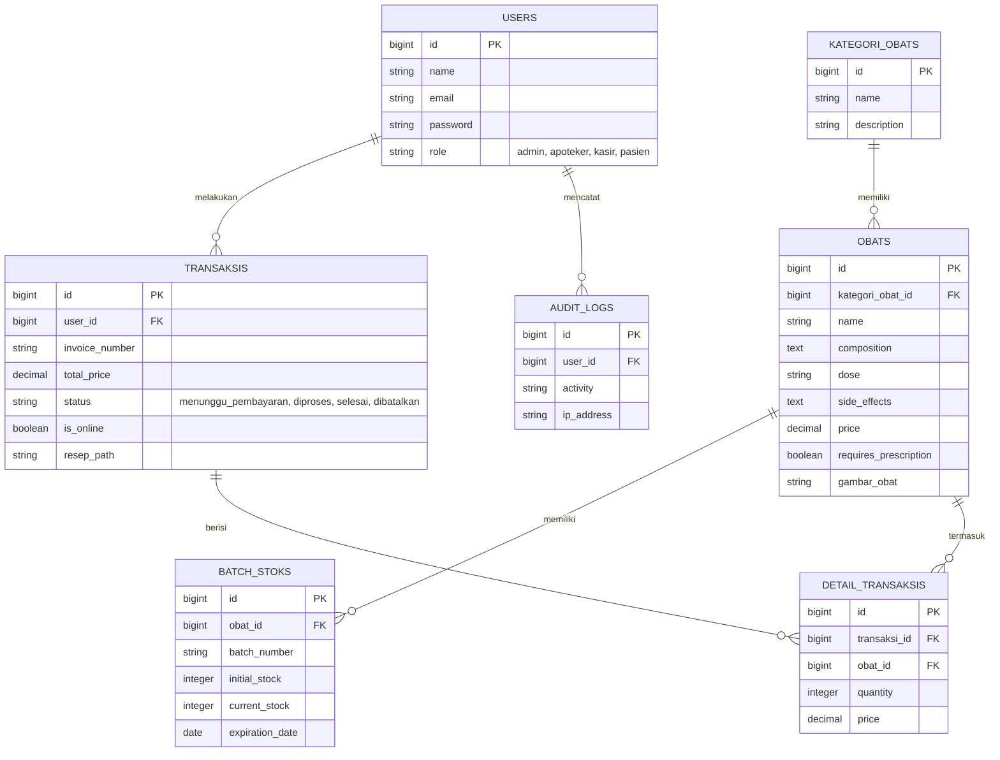

# DOKUMEN ANALISIS, PERANCANGAN, DAN DESAIN TEKNIS SISTEM
## Sistem E-Commerce Penjualan Obat Klinik Makmur Jaya

Dokumen ini disusun untuk memenuhi Unit Kompetensi Analisis dan Perancangan Teknis:
1. TIK.SM03.001.01 Menentukan Arsitektur Perangkat Keras
2. J.620100.001.01 Menganalisis Tools
3. J.620100.002.01 Menganalisis Skalabilitas Perangkat Lunak
4. J.620100.003.01 Melakukan Identifikasi Library, Komponen Atau Framework Yang Diperlukan
5. J.620100.020.02 Menggunakan SQL
6. J.620100.022.02 Mengimplementasikan Algoritma Pemrograman
7. J.620100.028.02 Menerapkan Pemrograman Real Time
8. J.620100.029.02 Menerapkan Pemrograman Paralel
9. J.620100.030.02 Menerapkan Pemrograman Multimedia

---

### 1. Arsitektur Perangkat Keras (Hardware Architecture)

Sistem e-commerce Klinik Makmur Jaya menggunakan topologi server terpisah untuk menjamin ketersediaan tinggi (*high availability*) dan keamanan data.

#### 1.1 Diagram Topologi Jaringan

```
                     +------------------------+
                     |    Klien (Browser)     |
                     +------------------------+
                                  |
                                  | (HTTPS)
                                  v
                     +------------------------+
                     |      Load Balancer     |
                     +------------------------+
                                  |
            +---------------------+---------------------+
            | (HTTP)                                    | (HTTP)
            v                                           v
+------------------------+                  +------------------------+
|    Web Server Node 1   |                  |    Web Server Node 2   |
|   (PHP 8.4 + Apache)   |                  |   (PHP 8.4 + Apache)   |
+------------------------+                  +------------------------+
            |                                           |
            +---------------------+---------------------+
                                  |
                                  v
                     +------------------------+
                     |    Database Server     |
                     |      (MySQL 8.0)       |
                     +------------------------+
```

#### 1.2 Spesifikasi Infrastruktur Minimum

| Komponen | Spesifikasi Minimum | Fungsi Utama |
| :--- | :--- | :--- |
| **Web Server** | Virtual Private Server (VPS), 2 Cores CPU, 4 GB RAM, 40 GB SSD Storage, Bandwidth 100 Mbps. | Melayani request HTTP, kompilasi Livewire, dan parsing berkas multimedia. |
| **Database Server** | Dedicated Managed Database, 2 Cores CPU, 8 GB RAM, 50 GB NVMe Storage (RAID-10). | Memproses kueri SQL transaksi dan menjamin integritas data ACID. |
| **Client Device** | Browser modern (Chrome/Edge/Safari/Firefox), Resolusi layar min. 1024x768. | Mengakses UI reaktif pasien, kasir POS, dan panel admin. |

---

### 2. Analisis Pemilihan Tools dan Framework

#### 2.1 Bahasa dan Kerangka Kerja Utama
*   **PHP 8.4 & Laravel 11:** PHP 8.4 menghadirkan optimasi performa compiler JIT, sedangkan Laravel 11 menyederhanakan konfigurasi direktori dan secara native memproses asinkronisasi antrean queue melalui driver database atau redis.
*   **Livewire 3:** Digunakan untuk memfasilitasi komunikasi asinkron dua arah secara dinamis. State data tetap tersimpan di backend, sedangkan UI diperbarui secara responsif tanpa reload halaman.
*   **Tailwind CSS & Alpine.js:** Tailwind CSS mempercepat styling premium berbasis utility-first, sementara Alpine.js menangani logika interaktif sisi klien (seperti membuka modal dialog status dan dropdown navigasi).

#### 2.2 Inventarisasi Library Pihak Ketiga (Third-Party Libraries)

| Nama Library | Versi | Lisensi | Fungsi dalam Sistem |
| :--- | :--- | :--- | :--- |
| **barryvdh/laravel-dompdf** | ^3.0 | LGPL | Membaca view HTML dan merendernya menjadi laporan PDF resmi untuk Apoteker. |
| **blade-ui-kit/blade-heroicons** | ^2.4 | MIT | Menyediakan ikon `<x-heroicon-...>` yang bebas emoji untuk mendukung antarmuka. |

---

### 3. Arsitektur Database Relasional (ERD & SQL)

#### 3.1 Entity Relationship Diagram (ERD)



#### 3.2 Implementasi Kueri SQL Kompleks (Kompatibel MySQL)

##### Kueri 1: Rekap Laporan Total Pendapatan Bulanan
```sql
SELECT 
    DATE_FORMAT(created_at, '%Y-%m') AS bulan,
    COUNT(id) AS total_transaksi,
    SUM(total_price) AS total_pendapatan
FROM transaksis
WHERE status = 'selesai'
GROUP BY DATE_FORMAT(created_at, '%Y-%m')
ORDER BY bulan DESC;
```

##### Kueri 2: Analisis 5 Produk Obat Terlaris (Best Seller)
```sql
SELECT 
    o.id,
    o.name AS nama_obat,
    SUM(dt.quantity) AS total_terjual
FROM detail_transaksis dt
JOIN obats o ON dt.obat_id = o.id
JOIN transaksis t ON dt.transaksi_id = t.id
WHERE t.status = 'selesai'
GROUP BY o.id, o.name
ORDER BY total_terjual DESC
LIMIT 5;
```

##### Kueri 3: Pemantauan Obat Mendekati Kadaluarsa (Maksimal 90 Hari Ke Depan)
```sql
SELECT 
    o.name AS nama_obat,
    bs.batch_number,
    bs.current_stock,
    bs.expiration_date,
    DATEDIFF(bs.expiration_date, CURDATE()) AS sisa_hari
FROM batch_stoks bs
JOIN obats o ON bs.obat_id = o.id
WHERE bs.current_stock > 0 
  AND bs.expiration_date <= DATE_ADD(CURDATE(), INTERVAL 90 DAY)
ORDER BY bs.expiration_date ASC;
```

---

### 4. Implementasi Algoritma dan Pemrograman Khusus

#### 4.1 Algoritma Pencarian Autocomplete & Fuzzy Search
Sistem mengimplementasikan pencarian obat secara dinamis menggunakan kueri SQL `LIKE` yang digabungkan dengan binding reaktif Livewire `wire:model.live.debounce.300ms` untuk menghindari kueri berulang yang sia-sia:
```php
$searchString = '%' . $this->search . '%';
$this->obats = Obat::where('name', 'like', $searchString)
    ->orWhere('composition', 'like', $searchString)
    ->with('kategoriObat')
    ->limit(10)
    ->get();
```

#### 4.2 Algoritma Pengurangan Stok Otomatis Berbasis FIFO (First In First Out)
Setiap kali transaksi diselesaikan, sistem wajib memotong stok fisik dari batch obat yang paling cepat kedaluwarsa. Algoritma ini berjalan dalam sebuah transaksi database terisolasi (`DB::transaction`):

```php
// Loop setiap item obat yang dibeli
foreach ($items as $item) {
    $remainingQty = $item->quantity;

    // Ambil batch stok yang aktif (stok > 0 dan belum exp), urutkan dari yang tercepat exp
    $batches = BatchStok::where('obat_id', $item->obat_id)
        ->where('current_stock', > , 0)
        ->where('expiration_date', > , now()->toDateString())
        ->orderBy('expiration_date', 'asc')
        ->lockForUpdate() // Kunci baris untuk cegah race condition
        ->get();

    foreach ($batches as $batch) {
        if ($remainingQty <= 0) break;

        if ($batch->current_stock >= $remainingQty) {
            $batch->decrement('current_stock', $remainingQty);
            $remainingQty = 0;
        } else {
            $remainingQty -= $batch->current_stock;
            $batch->update(['current_stock' => 0]);
        }
    }

    if ($remainingQty > 0) {
        throw new \Exception("Stok obat {$item->obat->name} tidak mencukupi untuk memenuhi FIFO!");
    }
}
```

#### 4.3 Pemrograman Real-Time (Real-Time DOM Updates)
Livewire secara asinkron melakukan polling data dashboard secara dinamis setiap 10 detik tanpa reload:
```html
<div wire:poll.10s class="grid grid-cols-1 md:grid-cols-3 gap-6">
    <!-- Ringkasan Stok & Pendapatan Real-time -->
</div>
```

#### 4.4 Pemrograman Paralel (CSV Chunk Processing)
Untuk mengimpor data obat yang besar tanpa menyumbat memori web server, parsing CSV dibagi menjadi potongan-potongan kecil (*chunks*) dan diproses secara berurutan dalam antrean:
```php
// Baca file CSV dan jalankan bulk insert per 500 baris
LazyCollection::make(function () use ($filePath) {
    $file = fopen($filePath, 'r');
    while (($line = fgetcsv($file, 1000, ';')) !== false) {
        yield $line;
    }
    fclose($file);
})
->skip(1)
->chunk(500)
->each(function ($chunk) {
    // Proses bulk insert secara kolektif
    Obat::insert($chunk->toArray());
});
```

#### 4.5 Pemrograman Multimedia (Image Preview & Ekspor Laporan PDF)
*   **Preview Upload:** Menggunakan fitur upload bawaan Livewire `TemporaryUploadedFile` yang langsung merender pratinjau gambar tanpa reload halaman.
*   **PDF Report:** DOMPDF digunakan untuk mengonversi berkas HTML templated yang berisi tabel berwarna, logo klinik, dan ringkasan keuangan menjadi dokumen PDF dinamis.
