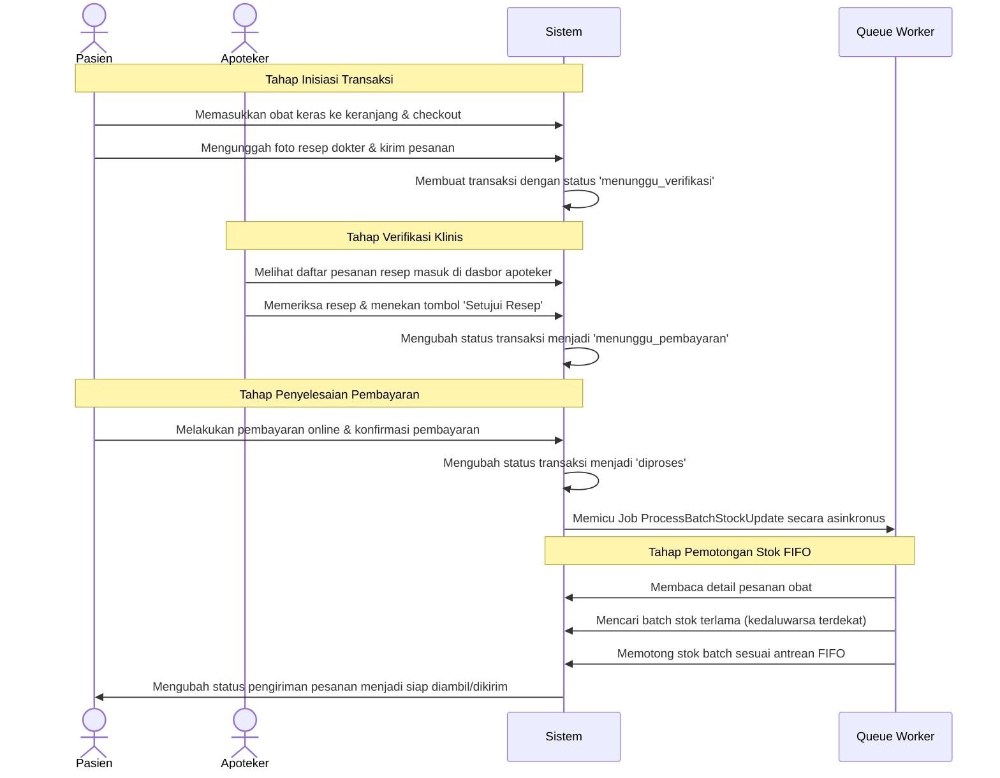

# Analisis Peran dan Skenario Penggunaan (Use Case Analysis)

Dokumen ini mendefinisikan arsitektur hak akses (Role-Based Access Control) dan skenario penggunaan dalam Sistem E-Commerce Penjualan Obat Berbasis Web Klinik Makmur Jaya. Dokumentasi ini disusun untuk memberikan gambaran rinci mengenai batasan fungsional serta alur bisnis yang terjadi di dalam sistem bagi auditor dan penguji sertifikasi.

---

## 1. Pendahuluan & Matriks Hak Akses (Access Control Matrix)

Sistem menerapkan kontrol akses berbasis peran (RBAC) secara ketat untuk menjamin keamanan data medis dan integritas transaksi obat. Penegakan hak akses dilakukan pada tingkat routing (middleware), komponen UI (Livewire/Blade), dan query database.

Tabel di bawah ini memetakan hubungan antara peran pengguna (roles) dengan hak akses terhadap fitur atau modul spesifik di dalam sistem:

| Fitur / Modul | Admin | Apoteker | Kasir | Pasien |
| :--- | :---: | :---: | :---: | :---: |
| Login / Register / Verifikasi Email | Ya | Ya | Ya | Ya |
| CRUD Master Kategori & Obat | Ya | Tidak | Tidak | Tidak |
| Batch Import Data Obat (CSV Parallel) | Ya | Tidak | Tidak | Tidak |
| Melihat Log Aktivitas & Log Sistem | Ya | Tidak | Tidak | Tidak |
| Dashboard & Metrik Penjualan Utama | Ya | Tidak | Tidak | Tidak |
| Monitoring Stok Kedaluwarsa (Batch) | Tidak | Ya | Tidak | Tidak |
| Verifikasi Resep Dokter (Online) | Tidak | Ya | Tidak | Tidak |
| Cetak Laporan Penjualan (PDF Async) | Tidak | Ya | Tidak | Tidak |
| Point of Sale (POS) Konter Offline | Tidak | Tidak | Ya | Tidak |
| Manajemen Transaksi Langsung Konter | Tidak | Tidak | Ya | Tidak |
| Pencarian & Filter Katalog Obat | Tidak | Tidak | Tidak | Ya |
| Kelola Keranjang Belanja (Session) | Tidak | Tidak | Tidak | Ya |
| Checkout & Unggah Resep Dokter | Tidak | Tidak | Tidak | Ya |
| Monitoring Status Transaksi Online | Tidak | Tidak | Tidak | Ya |

---

## 2. Analisis Mendalam Peran: ADMIN

### Tanggung Jawab Utama
Admin bertanggung jawab penuh atas manajemen konfigurasi sistem, pemeliharaan keandalan data master (obat dan kategori), serta pemantauan keamanan sistem melalui audit trail dan analisis log error. Admin bertindak sebagai jangkar administratif untuk memastikan platform siap digunakan secara operasional.

### Kasus Penggunaan Eksplisit (Use Cases)
*   **Autentikasi Keamanan:** Mengakses gerbang masuk (login) menggunakan kredensial berstandar keamanan tinggi dan keluar dari sistem (logout) guna memutus session secara bersih.
*   **Manajemen Data Master Kategori (CRUD):** Membuat, membaca, memperbarui, dan menghapus kategori obat untuk menjaga klasifikasi inventaris secara logis.
*   **Manajemen Data Master Obat (CRUD):** Mengelola detail profil obat termasuk nama ilmiah, komposisi, efek samping, dosis, dan batas stok minimal untuk memicu peringatan restock.
*   **Batch Import CSV Secara Paralel:** Mengunggah berkas CSV berisi ribuan data obat baru secara simultan untuk memangkas waktu pemrosesan secara eksponensial dengan memanfaatkan optimasi database.
*   **Analisis Log Aktivitas (Audit Trail):** Memantau rekaman jejak digital dari setiap tindakan modifikasi data penting yang dilakukan oleh pengguna internal (Admin, Apoteker, Kasir) untuk kebutuhan akuntabilitas forensik.
*   **Pemantauan Log Error Sistem:** Membaca berkas log kesalahan sistem dengan klasifikasi tingkat keparahan tertentu (Critical, Warning, Info) demi mempercepat proses penanganan kendala teknis (debugging).
*   **Analisis Metrik Dasbor:** Mengamati indikator kinerja utama seperti total omzet harian, jumlah transaksi sukses, dan grafik 5 produk obat terlaris guna memberikan insight bisnis untuk pihak manajemen.

### Batasan Keamanan (Security Boundary)
*   **Verifikasi Resep Medis:** Admin dibatasi secara arsitektural untuk tidak dapat melakukan verifikasi resep dokter pada pesanan pasien online. Hak ini sepenuhnya milik profesional medis (Apoteker).
*   **Transaksi Mandiri Via POS:** Admin tidak memiliki akses ke antarmuka Point of Sale (POS) konter untuk melakukan transaksi penjualan langsung di lokasi ritel fisik apotek.

---

## 3. Analisis Mendalam Peran: APOTEKER

### Tanggung Jawab Utama
Apoteker memegang otoritas penuh terhadap aspek keselamatan klinis obat, validasi resep dokter, pengawasan kualitas masa berlaku (kadaluwarsa) stok obat di gudang, serta pelaporan keuangan obat secara periodik.

### Kasus Penggunaan Eksplisit (Use Cases)
*   **Monitoring Umur Simpan Batch Stok:** Memantau masa kedaluwarsa batch stok obat melalui indikator waktu (kurang dari 30 hari, 60 hari, dan 90 hari) untuk mencegah peredaran obat kedaluwarsa kepada konsumen.
*   **Verifikasi Resep Dokter:** Memeriksa dokumen resep yang diunggah oleh pasien online secara klinis, kemudian memberikan keputusan persetujuan (approve) untuk melanjutkan transaksi atau penolakan (reject) disertai alasan penolakan yang valid.
*   **Ekspor Laporan Penjualan (PDF):** Menghasilkan laporan rekapitulasi penjualan obat yang dieksekusi secara asinkronus (background job) untuk menjaga performa server, lalu mengunduh hasil dokumen PDF tersebut untuk keperluan arsip internal apotek.

### Batasan Keamanan (Security Boundary)
*   **Modifikasi Struktur Master Data:** Apoteker tidak diperkenankan melakukan manipulasi data master obat seperti mengubah harga dasar obat, menambahkan jenis obat baru, atau menghapus kategori obat dari database.
*   **Akses Konfigurasi & Infrastruktur:** Apoteker diblokir dari akses log sistem, data audit trail aktivitas server, serta dilarang menggunakan fitur impor paralel data obat.

---

## 4. Analisis Mendalam Peran: KASIR

### Tanggung Jawab Utama
Kasir bertanggung jawab atas kelancaran operasional transaksi ritel di gerai fisik Klinik Makmur Jaya. Peran ini berfokus pada kecepatan transaksi langsung di tempat (on-site) dengan mengutamakan akurasi pembayaran dan pengurangan stok seketika.

### Kasus Penggunaan Eksplisit (Use Cases)
*   **Akses Aplikasi Point of Sale (POS):** Menggunakan antarmuka khusus kasir yang ringan dan cepat untuk melayani pembelian obat langsung dari pelanggan konter.
*   **Pencarian Obat Cepat:** Mencari data ketersediaan obat dan batch stok aktif secara instan berdasarkan kata kunci nama obat guna mempercepat layanan antrean.
*   **Pemrosesan Transaksi Langsung:** Menyelesaikan pembelian dengan status pembayaran tunai langsung ("selesai") yang secara otomatis memicu antrean sistem (queue job) untuk memotong stok obat berdasarkan metode FIFO (First In, First Out).

### Batasan Keamanan (Security Boundary)
*   **Manajemen Inventaris:** Kasir tidak memiliki wewenang untuk menambahkan batch stok baru, melakukan restock obat, atau menghapus batch stok rusak dari sistem.
*   **Verifikasi Transaksi Online:** Kasir diisolasi secara mutlak dari proses kurasi pesanan online pasien dan tidak diizinkan mengubah status pemesanan resep dari web e-commerce.

---

## 5. Analisis Mendalam Peran: PASIEN

### Tanggung Jawab Utama
Pasien berperan sebagai pengguna eksternal yang memanfaatkan platform web e-commerce apotek untuk melakukan pencarian obat bebas, melakukan pemesanan obat resep secara legal, dan memantau status pesanan mereka secara mandiri.

### Kasus Penggunaan Eksplisit (Use Cases)
*   **Pendaftaran & Autentikasi Mandiri:** Mendaftarkan akun baru dengan kewajiban menggunakan sandi yang kuat (memenuhi kebijakan password minimal 8 karakter) serta melakukan verifikasi email aktif demi validasi pengguna.
*   **Pencarian & Penyaringan Katalog:** Melakukan pencarian obat secara fuzzy (pencarian fleksibel mendekati kata kunci) serta menyaring obat berdasarkan kategori terapeutik tertentu.
*   **Manajemen Keranjang Belanja:** Menyimpan daftar obat pilihan ke dalam keranjang berbasis session untuk akumulasi pesanan sebelum proses pembayaran.
*   **Checkout & Unggah Dokumen Resep:** Menyelesaikan transaksi dengan mengunggah gambar/foto fisik resep dokter apabila membeli obat berlabel obat keras atau obat wajib resep dokter.
*   **Monitoring Status Pesanan:** Memantau kemajuan status transaksi mulai dari menunggu verifikasi resep, menunggu pembayaran, proses pengemasan, hingga pesanan selesai.

### Batasan Keamanan (Security Boundary)
*   **Isolasi Route:** Pasien dibatasi secara ketat hanya pada ruang lingkup antarmuka publik. Setiap upaya untuk mengakses rute administrasi internal seperti `/admin/*`, `/apoteker/*`, atau `/kasir/*` akan dicegah oleh middleware otorisasi dan memicu respons pengecualian HTTP 403 Forbidden.

---

## 6. Skenario Lintas Peran (Cross-Role Workflows)

### Alur Pembelian Obat dengan Resep Dokter (E-Commerce Online)
Berikut adalah visualisasi alur transaksi terintegrasi yang melibatkan multi-peran secara berurutan:

Dalam alur di atas, sistem memastikan bahwa tidak ada kebocoran stok sebelum resep divalidasi oleh Apoteker dan dilunasi oleh Pasien. Antrean asinkron (Queue Worker) menjamin bahwa operasi pengurangan stok dilakukan secara konsisten mengikuti urutan tanggal kadaluwarsa terdekat tanpa membebani respon request pengguna utama.
