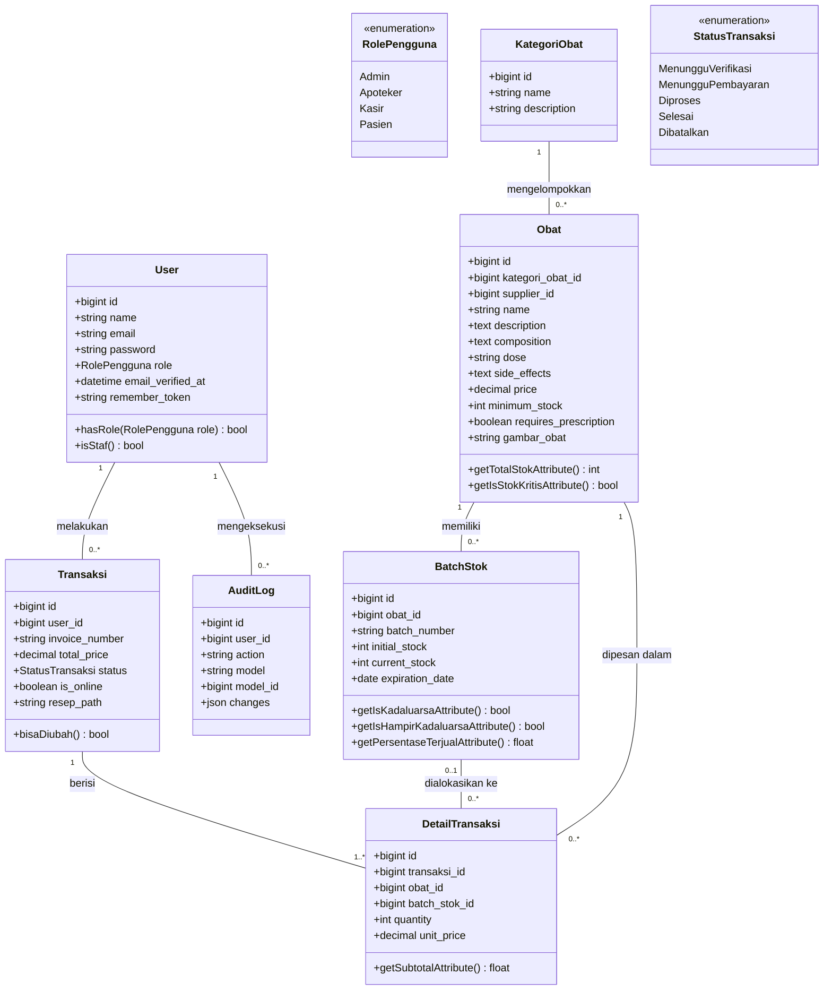
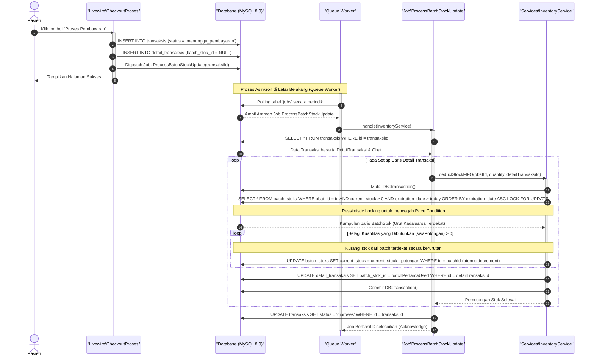

# DOKUMEN DESAIN SISTEM (SYSTEM DESIGN DOCUMENT)
## Sistem E-Commerce Penjualan Obat Klinik Makmur Jaya

> **Dokumen Audit Sertifikasi Kompetensi Nasional (BNSP)**  
> **Skema**: Web Developer  
> **Lokasi File**: `docs/system_design_document.md`

---

### 1. System Overview & Architecture

Sistem E-Commerce Penjualan Obat Klinik Makmur Jaya dirancang sebagai platform penjualan obat terintegrasi yang melayani transaksi online bagi Pasien serta transaksi offline di loket fisik (Point of Sale/POS) oleh Kasir. Sistem ini dirancang menggunakan arsitektur modern berkinerja tinggi untuk menjaga konsistensi data inventori medis yang krusial.

#### 1.1 Stack Teknologi & Pilihan Arsitektur
Sistem ini dibangun di atas **TALL Stack** (Tailwind CSS, Alpine.js, Laravel 11, Livewire 3) dengan spesifikasi teknis utama sebagai berikut:
*   **Core Logic**: Laravel 11 dengan runtime **PHP 8.4** untuk eksekusi fitur bahasa modern dan optimalisasi memori.
*   **Reaktifitas UI**: **Livewire 3** dan **Alpine.js** yang memungkinkan pembaharuan DOM secara asinkron (real-time updates) tanpa reload halaman.
*   **Penyimpanan Data**: **MySQL 8.0** dengan engine **InnoDB** yang menjamin kepatuhan penuh terhadap standar **ACID (Atomicity, Consistency, Isolation, Durability)**. Hal ini krusial untuk mencegah inkonsistensi stok saat terjadi transaksi konkuren tinggi.
*   **Security & Authorization**: Sistem Role-Based Access Control (RBAC) multi-level yang divalidasi ketat di tingkat rute dan kontrol menggunakan middleware kustom `RoleMiddleware` untuk 4 peran pengguna: **Admin, Apoteker, Kasir, dan Pasien**.
*   **Pemrosesan Asinkron (FIFO Queue)**: Pemotongan stok obat fisik berdasarkan metode FIFO (First In First Out / kadaluarsa terdekat) diproses di latar belakang menggunakan antrean database (`database queue connection`) melalui Laravel Queue Worker untuk menjaga responsivitas aplikasi web utama.

---

### 2. Global Use Case Diagram

Diagram Use Case di bawah ini menggambarkan fungsionalitas sistem yang dapat diakses oleh empat aktor manusia (Pasien, Apoteker, Kasir, Admin) serta satu aktor sistem otomatis (Queue Worker/Sistem).

```mermaid
graph TD
    %% Aktor
    Pasien["Pasien (Online User)"]
    Apoteker["Apoteker (Staf Medis)"]
    Kasir["Kasir (Staf POS)"]
    Admin["Admin"]
    QueueWorker["Queue Worker (Sistem)"]

    %% Batasan Sistem
    subgraph system ["Sistem E-Pharmacy Klinik Makmur Jaya"]
        UC_Reg(["Daftar Akun (Register)"])
        UC_Search(["Cari & Lihat Katalog Obat"])
        UC_Cart(["Manajemen Keranjang Belanja"])
        UC_Checkout(["Checkout Pesanan Online"])
        UC_Upload(["Unggah Resep Medis"])
        UC_Profile(["Kelola Profil"])
        UC_ViewTrans(["Melihat Transaksi Saya"])
        
        UC_Verify(["Verifikasi Resep Medis"])
        UC_POS(["Transaksi POS Offline"])
        UC_FIFO(["Potong Stok FIFO"])
        
        UC_Import(["Impor Data Obat via CSV"])
        UC_Master(["Kelola Master Data"])
        UC_Audit(["Lihat Log Aktivitas"])
        UC_Export(["Ekspor Laporan PDF"])
        
        UC_Auth(["Login, Logout & Kelola Akun"])
    end

    %% Relasi Aktor Pasien
    Pasien --> UC_Reg
    Pasien --> UC_Search
    Pasien --> UC_Cart
    Pasien --> UC_Checkout
    Pasien --> UC_Profile
    Pasien --> UC_ViewTrans
    Pasien --> UC_Auth

    %% Relasi Include/Extend
    UC_Checkout -.->|"<<extend>>"| UC_Upload
    UC_Checkout -.->|"<<include>>"| UC_FIFO
    UC_POS -.->|"<<include>>"| UC_FIFO

    %% Relasi Aktor Apoteker
    Apoteker --> UC_Verify
    Apoteker --> UC_Export
    Apoteker --> UC_Profile
    Apoteker --> UC_Auth

    %% Relasi Aktor Kasir
    Kasir --> UC_POS
    Kasir --> UC_Profile
    Kasir --> UC_Auth

    %% Relasi Aktor Admin
    Admin --> UC_Import
    Admin --> UC_Audit
    Admin --> UC_Export
    Admin --> UC_Master
    Admin --> UC_Profile
    Admin --> UC_Auth

    %% Relasi Queue Worker
    QueueWorker --> UC_FIFO
```

---

### 3. Comprehensive Use Case Descriptions (Semua Role & Fitur)

Berikut adalah rincian skenario operasional use case yang ada pada sistem untuk seluruh peran (Pasien, Kasir, Apoteker, Administrator) secara tabular lengkap:

---

#### 3.1 Use Case Role: Pasien (Pasien / Pelanggan)

##### UC-PL-01: Pendaftaran Akun Baru (Register)
| Bagian | Deskripsi Detail |
| :--- | :--- |
| **Use Case ID & Nama** | UC-PL-01: Pendaftaran Akun Baru (Register) |
| **Aktor Utama** | Pasien |
| **Pre-kondisi** | Pasien belum login dan berada di halaman pendaftaran. |
| **Main Success Scenario (Basic Flow)** | 1. Pasien membuka halaman Pendaftaran Akun (`/register`). 2. Pasien memasukkan data diri: Nama Lengkap, Alamat Email, Kata Sandi, dan Konfirmasi Kata Sandi. 3. Pasien mengklik tombol "Daftar Sekarang". 4. Sistem melakukan enkripsi (hashing) pada password menggunakan algoritma bcrypt/Argon2. 5. Sistem membuat record user baru dengan role `pasien` (`RolePengguna::Pasien`). 6. Sistem mengirimkan event pendaftaran (`Registered`) dan melakukan login otomatis (`Auth::login`). 7. Sistem mengarahkan pasien ke halaman dasbor utama / katalog obat. |
| **Alternative/Exception Flow** | **A1: Data masukan tidak valid (email duplikat, password terlalu pendek)**: 1. Sistem membatalkan pendaftaran. 2. Sistem menampilkan pesan kesalahan validasi pada field yang bermasalah. |
| **Post-kondisi** | Akun pasien berhasil dibuat, tersimpan di database, dan session login aktif. |

##### UC-PL-02: Cari & Lihat Katalog Obat
| Bagian | Deskripsi Detail |
| :--- | :--- |
| **Use Case ID & Nama** | UC-PL-02: Cari & Lihat Katalog Obat |
| **Aktor Utama** | Pasien / Publik |
| **Pre-kondisi** | Pengguna mengakses halaman beranda katalog obat klinik. |
| **Main Success Scenario (Basic Flow)** | 1. Pengguna mengetik kata kunci pada kotak pencarian katalog. 2. Sistem mem-filter daftar obat berdasarkan nama atau komposisi menggunakan pencarian dinamis secara real-time (`wire:model.live.debounce`). 3. Pengguna mengklik salah satu kartu obat. 4. Sistem memuat halaman Detail Obat (`/katalog/{obat}`) dan menampilkan spesifikasi lengkap (deskripsi, efek samping, komposisi, harga, total stok aktif, serta indikasi kebutuhan resep). |
| **Alternative/Exception Flow** | **A1: Obat tidak ditemukan**: 1. Sistem menampilkan antarmuka kosong dengan pesan "Obat tidak ditemukan". |
| **Post-kondisi** | Pengguna berhasil membaca rincian produk obat yang valid sebelum memesan. |

##### UC-PL-03: Kelola Keranjang Belanja
| Bagian | Deskripsi Detail |
| :--- | :--- |
| **Use Case ID & Nama** | UC-PL-03: Kelola Keranjang Belanja |
| **Aktor Utama** | Pasien |
| **Pre-kondisi** | Pasien sedang melihat katalog atau halaman detail obat yang memiliki stok aktif tersedia. |
| **Main Success Scenario (Basic Flow)** | 1. Pasien menekan tombol "Tambah Ke Keranjang" pada item obat. 2. Sistem secara dinamis menyimpan item tersebut ke dalam `session` keranjang. 3. Pasien membuka halaman keranjang belanja (`/keranjang`). 4. Pasien dapat mengubah kuantitas pesanan atau menghapus obat dari keranjang. 5. Sistem memperbarui total harga pesanan secara real-time menggunakan reaktivitas Livewire. |
| **Alternative/Exception Flow** | **A1: Kuantitas pesanan melebihi stok yang tersedia**: 1. Sistem membatalkan penambahan jumlah. 2. Sistem memunculkan alert berisi batasan maksimal stok. |
| **Post-kondisi** | Session keranjang belanja terupdate sesuai dengan aksi yang dipilih oleh pasien. |

##### UC-PL-04: Checkout Pesanan & Upload Resep Medis
| Bagian | Deskripsi Detail |
| :--- | :--- |
| **Use Case ID & Nama** | UC-PL-04: Checkout Pesanan & Upload Resep Medis |
| **Aktor Utama** | Pasien |
| **Pre-kondisi** | Pasien telah login, memiliki obat di keranjang, dan minimal terdapat satu obat berkategori resep dokter (`requires_prescription = true`). |
| **Main Success Scenario (Basic Flow)** | 1. Pasien membuka halaman formulir checkout. 2. Sistem mendeteksi adanya obat resep di keranjang belanja dan mewajibkan unggah berkas resep. 3. Pasien mengunggah berkas resep dokter (format gambar/PDF, maks. 2MB). 4. Pasien mengklik tombol "Proses Pembayaran". 5. Sistem memvalidasi keberadaan berkas resep dan memanggil `InventoryService::cekKecukupanStok()` (non-blocking) untuk memastikan stok total tersedia. 6. Sistem menyimpan berkas resep secara aman di direktori publik server. 7. Sistem membuka transaksi database, menyimpan data induk transaksi dengan status `Menunggu Verifikasi Resep` (`status = 'menunggu_verifikasi'`), dan menyimpan data baris detail transaksi (`batch_stok_id` diinisialisasi `null`). 8. Sistem men-dispatch Job `ProcessBatchStockUpdate` ke antrean database. 9. Sistem mengosongkan keranjang belanja pasien. 10. Pasien diarahkan ke halaman checkout sukses. |
| **Alternative/Exception Flow** | **A1: File resep tidak diunggah atau tidak valid**: 1. Form memunculkan peringatan error validasi. 2. Transaksi ditolak dan tidak disimpan. **A2: Stok obat tidak mencukupi saat checkout**: 1. Sistem membatalkan proses checkout. 2. Sistem memunculkan alert toast berisi informasi obat yang kehabisan stok. 3. Pasien dikembalikan ke halaman keranjang. |
| **Post-kondisi** | Transaksi online berhasil dibuat dengan status `Menunggu Verifikasi Resep`, berkas resep tersimpan di server, dan keranjang belanja kosong. |

##### UC-PL-05: Pemantauan Riwayat Transaksi Pasien
| Bagian | Deskripsi Detail |
| :--- | :--- |
| **Use Case ID & Nama** | UC-PL-05: Pemantauan Riwayat Transaksi Pasien |
| **Aktor Utama** | Pasien |
| **Pre-kondisi** | Pasien telah login dan memiliki riwayat transaksi di sistem. |
| **Main Success Scenario (Basic Flow)** | 1. Pasien mengakses menu "Transaksi Saya" (`/transaksi-saya`). 2. Sistem mengambil data transaksi di database berdasarkan `user_id` milik pasien. 3. Pasien melihat rincian nomor invoice, total harga, riwayat status (Menunggu Verifikasi, Menunggu Pembayaran, Diproses, Selesai, Dibatalkan) dan rincian obat yang dipesan. |
| **Alternative/Exception Flow** | **A1: Pasien belum memiliki transaksi**: 1. Sistem menampilkan teks panduan "Belum ada transaksi". |
| **Post-kondisi** | Pasien berhasil melacak kemajuan status pesanan mereka secara transparan. |

##### UC-PL-06: Manajemen Profil Pengguna
| Bagian | Deskripsi Detail |
| :--- | :--- |
| **Use Case ID & Nama** | UC-PL-06: Manajemen Profil Pengguna |
| **Aktor Utama** | Pasien (Berlaku untuk semua Role) |
| **Pre-kondisi** | Pengguna telah login ke dalam sistem. |
| **Main Success Scenario (Basic Flow)** | 1. Pengguna membuka halaman Profil (`/profile`). 2. Pengguna memperbarui data informasi profil (Nama, Email) atau memperbarui kata sandi (Password). 3. Pengguna mengklik tombol "Simpan". 4. Sistem memvalidasi input, melakukan update data ke tabel `users`, dan menampilkan pesan flash sukses. |
| **Alternative/Exception Flow** | **A1: Konfirmasi kata sandi baru tidak cocok atau password saat ini salah**: 1. Sistem menolak pembaruan. 2. Sistem menampilkan pesan error validasi input password pada form. |
| **Post-kondisi** | Profil user terupdate secara dinamis di database. |

---

#### 3.2 Use Case Role: Kasir (Staf Loket Fisik / POS)

##### UC-KS-01: Entri & Autocomplete Pencarian Obat POS
| Bagian | Deskripsi Detail |
| :--- | :--- |
| **Use Case ID & Nama** | UC-KS-01: Entri & Autocomplete Pencarian Obat POS |
| **Aktor Utama** | Kasir |
| **Pre-kondisi** | Kasir telah berhasil masuk ke modul POS Konter (`/kasir/pos`). |
| **Main Success Scenario (Basic Flow)** | 1. Kasir memfokuskan kursor pada kolom pencarian kode/nama obat. 2. Kasir mengetik minimal 2 karakter. 3. Sistem mendeteksi perubahan input reaktif (`updatedCariObat`) dan melakukan pencarian cepat ke database. 4. Sistem merender dropdown hasil pencarian berupa nama obat dan harganya secara asinkron. 5. Kasir mengklik nama obat untuk menambahkannya ke keranjang belanja POS. |
| **Alternative/Exception Flow** | **A1: Pencarian di bawah 2 karakter**: 1. Dropdown pencarian ditutup dan sistem mengosongkan daftar hasil pencarian cepat. |
| **Post-kondisi** | Keranjang belanja POS diperbarui dengan item obat terpilih secara efisien. |

##### UC-KS-02: Pemrosesan Transaksi POS Langsung (Offline) & Sinkronisasi FIFO
| Bagian | Deskripsi Detail |
| :--- | :--- |
| **Use Case ID & Nama** | UC-KS-02: Pemrosesan Transaksi POS Langsung (Offline) & Sinkronisasi FIFO |
| **Aktor Utama** | Kasir & Queue Worker (Sistem) |
| **Pre-kondisi** | Kasir telah login ke POS Konter, dan terdapat pelanggan di loket fisik. |
| **Main Success Scenario (Basic Flow)** | 1. Kasir mencari obat menggunakan input pencarian autocomplete. 2. Sistem merender hasil pencarian secara reaktif. 3. Kasir menambahkan item obat ke keranjang belanja POS lokal. 4. Kasir memilih metode pembayaran langsung (tunai) dan menekan tombol "Bayar". 5. Sistem secara sinkron memanggil `InventoryService::cekKecukupanStok()` untuk validasi. 6. Sistem membuat header transaksi offline dengan status langsung `Selesai` (`status = 'selesai'`, `is_online = false`). 7. Sistem menyimpan item detail transaksi. 8. Sistem memanggil `InventoryService::deductStockFIFO()` secara sinkron untuk memotong stok batch fisik. 9. `InventoryService` melakukan kueri batch stok diurutkan berdasarkan tanggal kadaluarsa terdekat (`expiration_date ASC`) dan melakukan penguncian pesimistis (`lockForUpdate()`). 10. Sistem mengurangi stok batch secara atomic (decrement), mencatat log audit pemotongan FIFO, dan memperbarui `batch_stok_id` di `detail_transaksis`. 11. Sistem men-dispatch `ProcessBatchStockUpdate` ke antrean. 12. Queue worker mengambil job dari antrean, membaca status transaksi (`Selesai`), mendeteksi bahwa status bukan `Menunggu Pembayaran`, lalu melewati proses pemotongan (karena sudah diselesaikan secara sinkron di langkah 8-10) untuk menghindari double-deduction. |
| **Alternative/Exception Flow** | **A1: Stok salah satu item tidak mencukupi saat tombol bayar ditekan**: 1. Transaksi dibatalkan secara otomatis. 2. POS menampilkan pesan toast "Stok tidak mencukupi". 3. Item keranjang tetap tersimpan di memori lokal agar kasir dapat menyesuaikannya. |
| **Post-kondisi** | Transaksi POS offline tercatat selesai, stok fisik didekremen berdasarkan batch kadaluarsa terdekat (FIFO) secara aman, log audit tercatat, dan invoice diterbitkan. |

---

#### 3.3 Use Case Role: Apoteker (Staf Verifikasi & Pengawas Obat)

##### UC-AP-01: Verifikasi Resep Medis Pasien
| Bagian | Deskripsi Detail |
| :--- | :--- |
| **Use Case ID & Nama** | UC-AP-01: Verifikasi Resep Medis Pasien |
| **Aktor Utama** | Apoteker |
| **Pre-kondisi** | Apoteker telah login ke dasbor apoteker, dan terdapat transaksi pasien dengan status `Menunggu Verifikasi Resep`. |
| **Main Success Scenario (Basic Flow)** | 1. Apoteker membuka Dasbor Apoteker. 2. Sistem memuat daftar pesanan menunggu verifikasi secara real-time. 3. Apoteker mengklik tautan berkas resep untuk memverifikasi dokumen secara visual. 4. Apoteker mencocokkan dosis dan jenis obat, kemudian menekan tombol "Setujui Resep". 5. Sistem memperbarui status transaksi menjadi `Menunggu Pembayaran`. 6. Sistem men-dispatch ulang Job `ProcessBatchStockUpdate` ke antrean. 7. Sistem mencatat aktivitas verifikasi ini ke dalam tabel `audit_logs` (`action = 'verify_prescription'`). 8. Sistem menampilkan toast notifikasi persetujuan berhasil kepada apoteker. |
| **Alternative/Exception Flow** | **A1: Apoteker membatalkan transaksi karena resep tidak valid**: 1. Apoteker mengklik tombol "Batalkan Transaksi" (jika tersedia). 2. Sistem memperbarui status transaksi menjadi `Dibatalkan` tanpa memotong stok. 3. Log aktivitas pencatatan pembatalan disimpan. |
| **Post-kondisi** | Status transaksi diperbarui ke `Menunggu Pembayaran` dan antrean Job background di-dispatch untuk dieksekusi oleh queue worker. |

##### UC-AP-02: Monitoring Stok Kritis & Masa Kadaluarsa Obat (Dashboard Alert)
| Bagian | Deskripsi Detail |
| :--- | :--- |
| **Use Case ID & Nama** | UC-AP-02: Monitoring Stok Kritis & Masa Kadaluarsa Obat (Dashboard Alert) |
| **Aktor Utama** | Apoteker |
| **Pre-kondisi** | Apoteker masuk ke Dasbor Apoteker (`/apoteker/dashboard`). |
| **Main Success Scenario (Basic Flow)** | 1. Sistem memicu fungsi `InventoryService` untuk mencari batch stok yang mendekati kadaluarsa (di bawah 90 hari) dan obat dengan stok di bawah batas minimum (`minimum_stock`). 2. Sistem merender panel peringatan stok kritis. 3. Sistem merender daftar batch obat yang sudah kadaluarsa untuk tindakan penarikan barang. 4. Apoteker melihat data tersebut untuk merencanakan pengadaan obat baru kepada supplier. |
| **Alternative/Exception Flow** | **T/A** |
| **Post-kondisi** | Apoteker mendapatkan informasi stok krusial untuk mencegah kelangkaan obat resep medis. |

##### UC-AP-03: Ekspor Laporan PDF Laporan Penjualan & Inventori
| Bagian | Deskripsi Detail |
| :--- | :--- |
| **Use Case ID & Nama** | UC-AP-03: Ekspor Laporan PDF Laporan Penjualan & Inventori |
| **Aktor Utama** | Apoteker / Admin |
| **Pre-kondisi** | Staf terverifikasi berada di menu Laporan Keuangan/Inventori. |
| **Main Success Scenario (Basic Flow)** | 1. Apoteker mengklik tombol "Ekspor PDF" (`/apoteker/laporan/export-pdf`). 2. Sistem menjalankan `LaporanPenjualanController::exportPdf` di backend. 3. Sistem mengompilasi view HTML laporan (total pendapatan bulanan, kuantitas obat terlaris, sisa stok per batch). 4. Library DOMPDF mengonversi view HTML tersebut menjadi file dokumen PDF terformat. 5. Browser pengguna mendownload file PDF laporan secara otomatis. |
| **Alternative/Exception Flow** | **A1: Terjadi kesalahan render pada library DOMPDF**: 1. Sistem menampilkan halaman error log 500. 2. Error dicatat ke server log untuk dianalisis developer. |
| **Post-kondisi** | Dokumen cetak fisik laporan penjualan bulanan berhasil diunduh secara lokal oleh apoteker. |

---

#### 3.4 Use Case Role: Administrator (Admin Utama)

##### UC-AD-01: Impor Data Obat via File CSV (Asinkron)
| Bagian | Deskripsi Detail |
| :--- | :--- |
| **Use Case ID & Nama** | UC-AD-01: Impor Data Obat via File CSV (Asinkron) |
| **Aktor Utama** | Admin |
| **Pre-kondisi** | Admin telah masuk ke panel admin, dan memiliki file CSV data obat dengan struktur kolom yang sesuai. |
| **Main Success Scenario (Basic Flow)** | 1. Admin membuka halaman Impor CSV. 2. Admin mengunggah berkas CSV. 3. Sistem memvalidasi format berkas (harus CSV/txt, ukuran maks. 2MB). 4. Berkas disimpan sementara ke direktori penyimpanan internal `imports`. 5. Sistem men-dispatch Job background `ProcessCsvImportJob` dengan parameter path berkas. 6. Sistem menampilkan pesan flash "File CSV sedang diproses di background." 7. Queue worker di background mengambil job tersebut. 8. Sistem mem-parsing file CSV secara kolektif menggunakan library Laravel Excel. 9. Sistem melakukan loop pada setiap baris data (melewati baris header) dan melakukan pembuatan record obat baru (`Obat::create`). 10. Sistem mencatat log keberhasilan impor setelah semua baris selesai diproses. |
| **Alternative/Exception Flow** | **A1: File bukan bertipe CSV**: 1. Validasi Livewire gagal. 2. Sistem membatalkan upload dan menampilkan pesan error. **A2: Terjadi kesalahan tipe data pada baris CSV**: 1. Eksekusi job di background mengalami kegagalan. 2. Job dipindahkan ke tabel `failed_jobs`, status error ditulis ke log sistem. |
| **Post-kondisi** | Data obat baru berhasil dimasukkan ke database secara asinkron tanpa mengganggu aktivitas interaktif admin di antarmuka web. |

##### UC-AD-02: Manajemen Master Data (Obat, Kategori, Supplier, Pelanggan)
| Bagian | Deskripsi Detail |
| :--- | :--- |
| **Use Case ID & Nama** | UC-AD-02: Manajemen Master Data (Obat, Kategori, Supplier, Pelanggan) |
| **Aktor Utama** | Admin |
| **Pre-kondisi** | Admin login dan memilih salah satu menu manajemen master data di sidebar navigasi. |
| **Main Success Scenario (Basic Flow)** | 1. Admin membuka halaman Manajemen (contoh: `/admin/obat`). 2. Sistem memuat daftar tabel data terkait. 3. Admin dapat melakukan operasi CRUD:    a. *Tambah Data*: Menekan tombol tambah, melengkapi modal formulir, menyimpan.    b. *Edit Data*: Menekan ikon edit pada baris tabel, memperbarui data formulir, menyimpan.    c. *Hapus Data*: Menekan tombol hapus, mengonfirmasi dialog konfirmasi. 4. Sistem memperbarui database relasional dan memperbarui tampilan UI secara dinamis (reaktif tanpa reload). |
| **Alternative/Exception Flow** | **A1: Menghapus data master yang memiliki keterikatan relasi aktif (mis: Kategori yang berisi obat)**: 1. Sistem menggagalkan operasi hapus. 2. Sistem memunculkan alert "Gagal menghapus: data terikat dengan modul lain" (integrity constraint violation). |
| **Post-kondisi** | Data master tersimpan di database dengan integritas relasi yang terjaga. |

##### UC-AD-03: Audit Log Viewer & Monitoring Aktivitas Staf
| Bagian | Deskripsi Detail |
| :--- | :--- |
| **Use Case ID & Nama** | UC-AD-03: Audit Log Viewer & Monitoring Aktivitas Staf |
| **Aktor Utama** | Admin |
| **Pre-kondisi** | Admin telah login dan mengakses halaman Log Aktivitas (`/admin/log`). |
| **Main Success Scenario (Basic Flow)** | 1. Admin membuka halaman Log Aktivitas. 2. Sistem memuat tabel histori audit log dari model `AuditLog` secara urut waktu terbalik (terbaru di atas). 3. Admin melihat detail log: Nama Staf yang mengeksekusi, Tipe Aksi (create, update, delete, verify_prescription), Model Objek, ID Objek, detail perubahan payload data, dan waktu eksekusi. 4. Admin dapat menggunakan pencarian kata kunci untuk mencari aktivitas tertentu. |
| **Alternative/Exception Flow** | **T/A** |
| **Post-kondisi** | Admin mendapatkan visibilitas penuh terhadap operasi data sensitif untuk keamanan operasional klinik. |

---

#### 3.5 Use Case Common (Semua Peran/Sistem Global)

##### UC-CM-01: Otentikasi Masuk & Keluar (Login & Logout)
| Bagian | Deskripsi Detail |
| :--- | :--- |
| **Use Case ID & Nama** | UC-CM-01: Otentikasi Masuk & Keluar (Login & Logout) |
| **Aktor Utama** | Semua Pengguna (Admin, Apoteker, Kasir, Pasien) |
| **Pre-kondisi** | Pengguna berada di halaman login (untuk masuk) atau sudah login (untuk keluar). |
| **Main Success Scenario (Basic Flow)** | 1. **Masuk (Login)**:    a. Pengguna membuka `/login`.    b. Pengguna memasukkan Email dan Password, lalu menekan "Masuk".    c. Sistem mencocokkan email dan melakukan verifikasi password hash.    d. Sistem meregenerasi session ID untuk mencegah session fixation.    e. Sistem mengarahkan user ke `/dashboard` yang kemudian dialihkan oleh middleware menuju dashboard khusus perannya. 2. **Keluar (Logout)**:    a. Pengguna menekan tombol "Keluar/Logout" di navigasi.    b. Sistem menghentikan session login, menghapus cookie otentikasi, dan mengarahkan kembali ke halaman katalog utama. |
| **Alternative/Exception Flow** | **A1: Kredensial login salah**: 1. Sistem menampilkan pesan error "Kredensial tersebut tidak cocok dengan data kami." 2. Halaman tidak memuat login sukses. |
| **Post-kondisi** | Status login pengguna berhasil terdaftar atau terhapus dari session server secara aman. |

---

### 4. Class Diagram

Diagram Kelas di bawah ini menggambarkan struktur entitas database, atribut beserta tipe datanya, dan relasi relasional di dalam aplikasi berdasarkan kode implementasi.

---

### 5. Sequence Diagram: FIFO Stock Deduction

Sequence Diagram berikut memvisualisasikan interaksi komponen sistem saat memproses pemotongan stok obat secara asinkron di background menggunakan algoritma FIFO (kadaluarsa terdekat didahulukan) setelah pembayaran dikonfirmasi.

